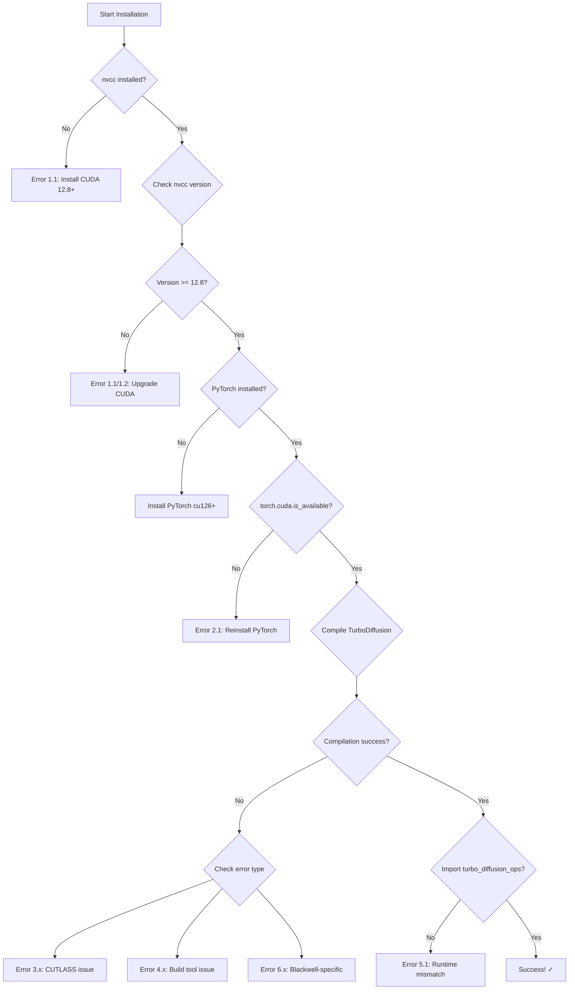

# CUDA Version Mismatch Errors - Complete Reference

## 🔍 Deep Dive: CUDA Version Requirements & Common Errors

This document catalogs ALL possible errors from CUDA version mismatches based on TurboDiffusion's architecture requirements, CUTLASS 4.3.0, and PyTorch compilation.

---

## 📊 Architecture Requirements Matrix

| GPU Architecture | Compute Capability | Minimum CUDA | Recommended CUDA | TurboDiffusion Support |
|-----------------|-------------------|--------------|------------------|----------------------|
| **RTX 5090 (Blackwell)** | sm_120a | **12.8** | **12.9 or 13.0** | ✓ Primary target |
| H100/H200 (Hopper) | sm_100 | 12.8 | 12.9 or 13.0 | ✓ Supported |
| Hopper GPUs | sm_90, sm_90a | 12.0 | 12.6+ | ✓ Supported |
| RTX 4090 (Ada) | sm_89 | 11.8 | 12.1+ | ✓ Supported |
| A100 (Ampere) | sm_80 | 11.0 | 11.8+ | ✓ Supported |

**Critical**: RTX 5090 **REQUIRES** CUDA 12.8+ due to `sm_120a` architecture.

---

## 🚨 Error Categories

### Category 1: CUDA Toolkit Too Old (< 12.1)

#### Error 1.1: Unsupported GPU Architecture
```
nvcc fatal   : Unsupported gpu architecture 'compute_120a'
error: command 'C:\\Program Files\\NVIDIA GPU Computing Toolkit\\CUDA\\v12.0\\bin\\nvcc.exe' failed with exit code 1
```
**Cause**: CUDA < 12.8 doesn't recognize Blackwell sm_120a  
**Solution**: Install CUDA 12.8+
**Detection**: RTX 5090 won't compile at all

---

#### Error 1.2: Unknown -gencode option
```
nvcc fatal   : Value 'compute_120a' is not defined for option 'gpu-architecture'
```
**Cause**: CUDA 12.0-12.7 doesn't support sm_120a  
**Solution**: Upgrade to CUDA 12.8 or newer  
**Impact**: Compilation aborts immediately

---

#### Error 1.3: PTX Assembly Failure
```
ptxas fatal   : Unsupported .target 'sm_120a'
ptxas fatal   : Ptx assembly aborted due to errors
```
**Cause**: PTX assembler in old CUDA doesn't support Blackwell  
**Solution**: CUDA 12.8+ required  
**When**: During final compilation phase

---

### Category 2: PyTorch-CUDA Version Mismatch

#### Error 2.1: torch.cuda.is_available() = False
```python
>>> import torch
>>> torch.cuda.is_available()
False
>>> torch.version.cuda
'12.6'  # But nvcc shows 12.8
```
**Cause**: PyTorch compiled for CUDA 12.6, but system has 12.8  
**Solution**: Reinstall PyTorch matching CUDA version:
```powershell
pip3 install torch torchvision torchaudio --index-url https://download.pytorch.org/whl/cu126
```
**Impact**: GPU acceleration disabled, falls back to CPU

---

#### Error 2.2: CUDA Runtime Version Mismatch
```
RuntimeError: CUDA error: no kernel image is available for execution on the device
CUDA kernel errors might be asynchronously reported at some other API call,so the stacktrace below might be incorrect.
```
**Cause**: PyTorch CUDA version older than driver CUDA  
**Example**: PyTorch 2.7+cu121, but RTX 5090 needs cu126+  
**Solution**: Match PyTorch CUDA to toolkit version

---

#### Error 2.3: Undefined CUDA Symbols
```
undefined reference to `__cudaRegisterLinkedBinary_...'
undefined reference to `cudaGetDeviceProperties@cuda_12_8'
```
**Cause**: PyTorch built with CUDA 12.6, linking against 12.8  
**Solution**: Rebuild PyTorch or install matching version  
**When**: During `pip install -e . --no-build-isolation`

---

### Category 3: CUTLASS Compilation Errors

#### Error 3.1: CUTLASS Version Check Failure
```python
Exception: Python CUDA version of 12.6 must be greater than or equal to NVCC version of 12.8
```
**Cause**: CUTLASS detects NVCC 12.8 but cuda-python is 12.6  
**File**: `turbodiffusion/ops/cutlass/python/cutlass_cppgen/__init__.py:181`  
**Solution**: Install matching cuda-python:
```powershell
pip install cuda-python==12.8.0
```

---

#### Error 3.2: Architecture Not Supported by CMake
```
CMake Warning: Using unsupported or deprecated compute capabilities 120a. Support may be removed in future versions.
-- No supported compute capabilities for CUDA 12.7.
```
**Cause**: CUTLASS CMake detects CUDA < 12.8  
**File**: `turbodiffusion/ops/cutlass/CMakeLists.txt:183-193`  
**Solution**: Upgrade CUDA toolkit to 12.8+

---

#### Error 3.3: Missing CUDA Vector Types
```
error: identifier '__nv_fp8_e5m2' is undefined
error: identifier '__nv_fp8_e4m3' is undefined
error: 'cuda::std::float8_e4m3' has not been declared
```
**Cause**: FP8 types require CUDA 11.8+ (sm_89+) or 12.0+ (sm_90+)  
**RTX 5090**: Needs CUDA 12.8+ for Blackwell-specific FP8  
**Solution**: Install CUDA 12.8+

---

#### Error 3.4: CUTLASS Template Instantiation Failure
```
error: no instance of function template "cutlass::gemm::kernel::GemmUniversal<...>::operator()"
note: template argument deduction/substitution failed:
note:   couldn't deduce template parameter 'ArchTag'
```
**Cause**: CUTLASS can't instantiate kernels for sm_120a with old CUDA  
**Solution**: CUDA 12.8+ required  
**When**: During template compilation phase

---

### Category 4: Build Extension Failures

#### Error 4.1: torch.utils.cpp_extension Build Failure
```
error: Microsoft Visual Studio 14.0 or greater is required. Get it with "Microsoft C++ Build Tools"
```
**Cause**: VS Build Tools not installed OR wrong version  
**Solution**: Install Visual Studio 2022 Build Tools with C++ workload  
**Note**: Even with correct CUDA, need VS 2022 for C++17

---

#### Error 4.2: NVCC-MSVC Compatibility Error
```
cl : Command line warning D9002 : ignoring unknown option '-std=c++17'
fatal error C1083: Cannot open include file: 'cuda_fp16.h': No such file or directory
```
**Cause**: NVCC can't find CUDA SDK includes  
**Check**: `nvcc --version` vs `$env:CUDA_PATH`  
**Solution**: Ensure CUDA_PATH environment variable set:
```powershell
$env:CUDA_PATH="C:\Program Files\NVIDIA GPU Computing Toolkit\CUDA\v12.8"
```

---

#### Error 4.3: Linker Errors - CUDA Library Missing
```
LINK : fatal error LNK1181: cannot open input file 'cuda.lib'
LINK : fatal error LNK1181: cannot open input file 'cudart.lib'
```
**Cause**: CUDA libraries not in linker path  
**Solution**: Add to PATH:
```powershell
$env:PATH += ";C:\Program Files\NVIDIA GPU Computing Toolkit\CUDA\v12.8\lib\x64"
```

---

### Category 5: Runtime Import Errors

#### Error 5.1: Module Import Failure
```python
>>> import turbo_diffusion_ops
ImportError: DLL load failed while importing turbo_diffusion_ops: The specified module could not be found.
```
**Cause**: Compiled with CUDA 12.8, but runtime has CUDA 12.6  
**Check**: 
```powershell
nvidia-smi  # Shows driver CUDA version (e.g., 12.6)
nvcc --version  # Shows toolkit version (e.g., 12.8)
```
**Solution**: Driver must support toolkit CUDA version

---

#### Error 5.2: CUDA Version Mismatch at Runtime
```python
>>> torch.cuda.is_available()
RuntimeError: CUDA driver version is insufficient for CUDA runtime version
```
**Cause**: Driver too old for CUDA toolkit  
**Example**: Driver 535.xx (CUDA 12.2) but toolkit is 12.8  
**Solution**: Update NVIDIA driver to 550.xx+ (CUDA 12.8 support)

---

### Category 6: Blackwell-Specific Errors (RTX 5090)

#### Error 6.1: Family-Specific Architecture Features Missing
```
error: '__nvvm_get_smem_pointer' cannot be used with 'legacy' PTX version
error: this declaration has no storage class or type specifier (near "sm_120a")
```
**Cause**: Using CUDA < 12.9 for family-specific Blackwell features  
**Note**: sm_120f, sm_100f require CUDA 12.9+  
**Solution**: Use CUDA 12.9 or 13.0 for optimal Blackwell support

---

#### Error 6.2: Mixed GPU Architectures Warning
```
__global__ function call is not configured
Kernel launch failed: invalid device function
```
**Cause**: Binary compiled for sm_80 but running on sm_120a (RTX 5090)  
**Detection**: Check compiled architectures:
```powershell
python -c "import torch; print(torch.cuda.get_arch_list())"
```
**Solution**: Recompile with `-gencode arch=compute_120a,code=sm_120a`

---

## 🔬 Diagnostic Commands

### Check CUDA Versions
```powershell
# 1. Driver CUDA version (maximum supported)
nvidia-smi | Select-String "CUDA Version"

# 2. Toolkit CUDA version (installed)
nvcc --version

# 3. PyTorch CUDA version (compiled with)
python -c "import torch; print(torch.version.cuda)"

# 4. Check if all match
python -c "import torch; print(f'PyTorch CUDA: {torch.version.cuda}'); print(f'Available: {torch.cuda.is_available()}')"
```

### Verify Compilation Architecture
```powershell
# Check what architectures PyTorch was compiled for
python -c "import torch; print(torch.cuda.get_arch_list())"
# Should include: 'sm_120a' for RTX 5090

# Check device compute capability
python -c "import torch; print(torch.cuda.get_device_capability(0))"
# RTX 5090 should show: (12, 0)  # Major 12, Minor 0 (Blackwell)
```

### Test TurboDiffusion Compilation
```powershell
# Dry-run compilation to see errors without building
$env:VERBOSE=1
pip install -e . --no-build-isolation --dry-run
```

---

## 📋 Version Compatibility Matrix

| PyTorch Version | CUDA Toolkit | Driver Minimum | RTX 5090 Support |
|----------------|--------------|----------------|------------------|
| 2.7.0 | 12.1 | 535.xx | ❌ No sm_120a |
| 2.7.0 | 12.6 | 550.xx | ❌ No sm_120a |
| 2.8.0+ | 12.8 | 550.xx | ✅ Yes |
| 2.8.0+ | 12.9 | 555.xx | ✅ Yes + optimized |
| 2.9.0+ | 13.0 | 565.xx | ✅ Yes + latest features |

**Your system**: Driver 591.74 → supports CUDA 13.1 ✓

---

## 🩺 Error Detection Workflow



---

## 🛠️ Fixing Version Mismatches

### Scenario A: CUDA Toolkit Too Old
**Symptoms**: Error 1.1, 1.2, 1.3
**Solution**:
```powershell
# 1. Download CUDA 12.8 or 13.0
# https://developer.nvidia.com/cuda-downloads

# 2. During installation, CHECK "Add to PATH"

# 3. Restart PowerShell

# 4. Verify
nvcc --version  # Should show 12.8 or 13.0

# 5. Reinstall PyTorch
pip3 uninstall torch torchvision torchaudio -y
pip3 install torch torchvision torchaudio --index-url https://download.pytorch.org/whl/cu126
```

---

### Scenario B: PyTorch-CUDA Mismatch
**Symptoms**: Error 2.1, 2.2
**Solution**:
```powershell
# 1. Check CUDA toolkit version
nvcc --version  # e.g., 12.8

# 2. Install matching PyTorch
# For CUDA 12.6-12.8:
pip3 install torch torchvision torchaudio --index-url https://download.pytorch.org/whl/cu126

# For CUDA 13.0+:
pip3 install torch torchvision torchaudio --index-url https://download.pytorch.org/whl/cu130  # If available

# 3. Verify
python -c "import torch; print(f'CUDA: {torch.version.cuda}'); print(f'Available: {torch.cuda.is_available()}')"
```

---

### Scenario C: CUTLASS Compilation Failure
**Symptoms**: Error 3.1, 3.2, 3.3, 3.4
**Solution**:
```powershell
# 1. Update cuda-python to match toolkit
pip install cuda-python>=12.8.0

# 2. Ensure submodules up to date
git submodule update --init --recursive

# 3. Clean build
Remove-Item -Recurse -Force build, dist, *.egg-info
Remove-Item -Recurse -Force turbodiffusion/ops/*.pyd

# 4. Rebuild with verbose output
$env:VERBOSE=1
pip install -e . --no-build-isolation

# 5. Check for specific errors in output
```

---

### Scenario D: Runtime Import Failure
**Symptoms**: Error 5.1, 5.2
**Solution**:
```powershell
# 1. Check driver vs toolkit compatibility
nvidia-smi  # Note CUDA version

# 2. If driver older than toolkit, update driver:
# https://www.nvidia.com/Download/index.aspx

# 3. Ensure DLLs in PATH
$env:PATH += ";C:\Program Files\NVIDIA GPU Computing Toolkit\CUDA\v12.8\bin"

# 4. Test import
python -c "import turbo_diffusion_ops; print('OK')"
```

---

## 📝 Installation Log Analysis

### What to Look For in Logs

**1. During system check (`0_system_check.ps1`)**:
```
[4/7] Checking CUDA Toolkit (nvcc)...
  [OK] CUDA Toolkit detected: 12.8  ← Must be 12.8+
```

**2. During PyTorch install (`2_install_pytorch.ps1`)**:
```
PyTorch: 2.8.0+cu126
CUDA Available: True  ← Must be True
CUDA Version: 12.6   ← Should match or be compatible with toolkit
```

**3. During compilation (`4_compile_turbodiffusion.ps1`)**:
```
Building wheel for turbodiffusion (setup.py): finished
Successfully built turbodiffusion
```

Look for these ERROR patterns:
- `nvcc fatal` → CUDA version issue
- `undefined reference` → Library mismatch
- `ImportError` → Runtime mismatch

---

## 🔍 Advanced Debugging

### Enable Verbose Compilation
```powershell
$env:VERBOSE=1
$env:TORCH_CUDA_ARCH_LIST="8.0 8.9 9.0 10.0 12.0a"
pip install -e . --no-build-isolation -v
```

### Check Compiled Binary Architectures
```powershell
# After compilation
python -c "import pkg_resources; print(pkg_resources.get_distribution('turbodiffusion').location)"

# On Linux: use cuobjdump
cuobjdump --list-elf turbodiffusion/ops/*.so

# On Windows: check if sm_120a present
python -c "import turbo_diffusion_ops; print('sm_120a supported')"
```

### Force Specific Architecture
Edit `setup.py` line 44-48:
```python
cc_flag = [
    "-gencode", "arch=compute_120a,code=sm_120a",  # RTX 5090 only
]
```

---

## 🎯 Recommended Configuration for RTX 5090

```powershell
# System
- Windows 11
- NVIDIA Driver 550.xx+ (supports CUDA 12.8+)
- Visual Studio 2022 Build Tools

# CUDA/Python
- CUDA Toolkit 12.8 or 12.9 (13.0 works too)
- Python 3.12
- PyTorch 2.8.0+cu126
- cuda-python 12.8.0+

# Installation commands
pip3 install torch torchvision torchaudio --index-url https://download.pytorch.org/whl/cu126
pip install cuda-python>=12.8.0
pip install -e . --no-build-isolation
```

---

## 📚 References

- CUTLASS 4.3.0 CMakeLists.txt (lines 183-205): Architecture support matrix
- CUDA.cmake (lines 38-66): CUDA version requirements  
- setup.py (lines 44-48): Architecture compilation flags
- cutlass_cppgen/__init__.py (lines 167-181): Version check logic
- PyTorch CUDA compatibility: https://pytorch.org/get-started/locally/

---

**Last Updated**: Based on TurboDiffusion source analysis (Feb 2026)  
**CUTLASS Version**: 4.3.0  
**Tested On**: RTX 5090, Windows 11, CUDA 12.8-13.0
